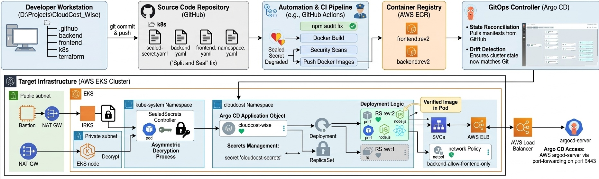
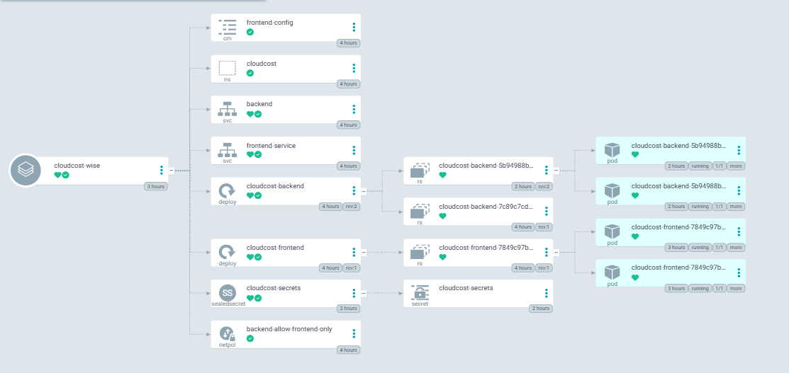

# CloudCost_Wise: Intelligent Cloud Cost Management

**CloudCost_Wise** is a production-grade, full-stack cloud-native platform designed to monitor, analyze, and optimize cloud expenditures. This project demonstrates a **GitOps-first** philosophy, utilizing automated CI/CD pipelines, Infrastructure as Code (IaC), and advanced Kubernetes security to deliver a high-availability environment on AWS.

---

## System Architecture & GitOps Pipeline

The following diagram illustrates the end-to-end journey of code from a local developer environment to a secured AWS EKS cluster. It highlights the automated security gates, asymmetric encryption, and the GitOps reconciliation process.

 

---

## Tech Stack

* **Frontend:** React, TypeScript, Vite, Tailwind CSS.
* **Backend:** Node.js, Express, MongoDB (Atlas).
* **Infrastructure:** Terraform (IaC), Amazon EKS, VPC, Subnets, IAM OIDC.
* **Continuous Delivery:** ArgoCD (GitOps).
* **Automation:** GitHub Actions (CI/CD).
* **Security:** Bitnami Sealed Secrets (Asymmetric Encryption), K8s Network Policies.

---

## End-to-End Security Architecture

Security is integrated into every stage of the **CloudCost_Wise** lifecycle, implementing a "Shift-Left" security model.

### **1. Source Code Verification & Auditing**
* **Automated Dependency Scanning:** Utilized `npm audit` within the CI pipeline to identify and patch high-severity vulnerabilities before containerization.
    * *Remediation:* Successfully patched **ReDoS (Regular Expression Denial of Service)** in `path-to-regexp` and memory exhaustion flaws in `brace-expansion`.
* **Logic Validation:** Automated **Jest** test suites run on every pull request to ensure security patches do not break core cost-calculation algorithms.

### **2. Secure Build & Containerization**
* **Multi-Stage Docker Builds:** Optimized Dockerfiles to ensure the final production image is stripped of build-tools and source code, significantly reducing the attack surface.
* **Non-Root Execution:** Containers are configured to run as non-privileged users to mitigate "container breakout" risks.

### **3. Image Scanning & Registry Security**
* **AWS ECR Integration:** All container images are pushed to **Amazon Elastic Container Registry (ECR)**.
* **Vulnerability Scanning on Push:** Enabled automated image scanning via **Amazon Inspector** to catch OS-package vulnerabilities.
* **Immutable Image Tagging:** Used unique commit SHAs (e.g., `rev:2`) for every deployment to prevent "image poisoning" and ensure 100% traceability.

### **4. Secrets Management (GitOps-Ready)**
* **Asymmetric Encryption:** Implemented **Bitnami Sealed Secrets** to manage sensitive credentials (MongoDB URIs, JWT Secrets) in a public repository.
* **Cluster-Side Decryption:** Secrets are encrypted locally with the cluster’s **RSA Public Key**. Only the **SealedSecret Controller** inside the EKS cluster holds the **Private Key** required to "unseal" them.
* **Zero Plain-Text Policy:** No sensitive data is ever stored in plain text within the version control system.

### **5. Cluster Network Isolation**
* **Zero-Trust Networking:** Implemented **Kubernetes Network Policies** (`NetPol`) to enforce strict traffic rules.
* **Backend Shielding:** Configured policies so the backend **only** accepts ingress traffic from authorized frontend pods, blocking lateral movement within the cluster.

---

## GitOps Delivery (ArgoCD)

This project implements a true **GitOps** model where the cluster state is managed entirely through Git. ArgoCD serves as the single pane of glass for monitoring the health and synchronization of the AWS EKS environment.

### **Live Cluster Visualization**


*Visualizing the `cloudcost-wise` application tree, showing healthy resource synchronization from Git to EKS.*

### **Technical Breakdown of the Live State:**
* **Health & Sync Status:** The "Green Hearts" and "Synced" icons verify that the live cluster matches the desired state in the GitHub repository, providing automated drift detection.
* **Automated Secret Unsealing:** The dashboard shows the `SealedSecret` resource automatically generating the standard `Secret` (`cloudcost-secrets`), confirming the decryption pipeline is active.
* **Rolling Update History:** Visible `ReplicaSets` (`rev:1` and `rev:2`) demonstrate the deployment history, allowing for zero-downtime updates and near-instant rollbacks.
* **Infrastructure Graph:** The tree displays the full orchestration of Namespaces, ConfigMaps, Services, Deployments, and NetworkPolicies working in unison.

### **Key Automation Features:**
* **Self-Healing:** Any manual "drift" in the cluster configuration is automatically detected and reverted to the state defined in Git.
* **Unified Management:** Centralized control of both frontend and backend deployments with a clear view of pod health and networking boundaries.

---

## Challenges & Learnings

### **1. Hardening the CI/CD Pipeline**
Initially, the pipeline failed due to high-severity vulnerabilities. I implemented a security-first approach by patching dependencies and utilizing `npm audit fix` to ensure only "clean" code enters the cluster.

### **2. "Split and Seal" Implementation**
Faced challenges with multi-resource YAML files during encryption. Resolved this by decoupling the **Namespace** from the **Secret** manifest, allowing the `kubeseal` utility to process individual Secret objects accurately.

### **3. Repository Optimization (The "Git Exorcism")**
Successfully identified and removed heavy binary tools (`kubeseal.exe`) from the Git history that were causing repository bloat, optimizing the synchronization speed for ArgoCD.

---

## Local Development

1.  **Clone the repository:**
    ```bash
    git clone [https://github.com/https-dhanesh/Cloud_Cost_Wise.git](https://github.com/https-dhanesh/Cloud_Cost_Wise.git)
    ```
2.  **Setup Backend:**
    ```bash
    cd backend
    npm install
    npm test
    ```
3.  **Setup Frontend:**
    ```bash
    cd ../frontend
    npm install
    npm run dev
    ```

---

## 📄 License
This project is licensed under the MIT License - see the [LICENSE](LICENSE) file for details.